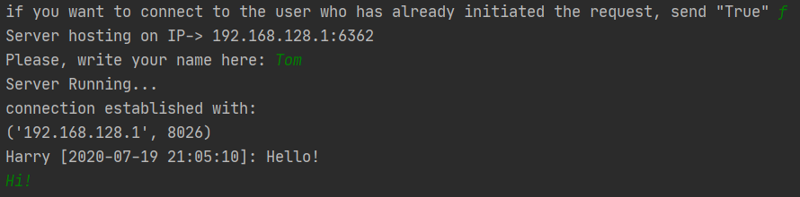
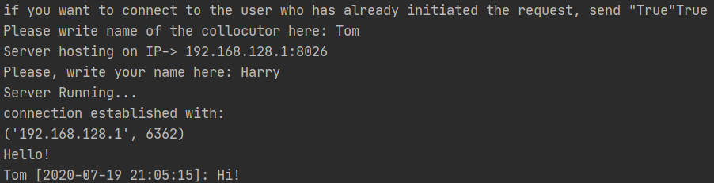

# UDP hole punching with Django
[UDP NAT hole punch](https://en.wikipedia.org/wiki/UDP_hole_punching) example implemented in python with Django
### Step 1: Install requirements
    pip install -r requirements.txt  
### Step 2 Perform database migration
    python manage.py makemigrations
    python manage.py migrate
### Step 3 Run Server
    python manage.py runserver
### Run client
    python posrednik/launcher.py

## Example

## Available in Docker
    docker pull fridi7/posrednik:v2
    docker build .
    docker run -it -p 8000:8000 posrednik
to launch launcher:

    docker ps
    docker exec -it <id> bash
    python app/launcher.py
